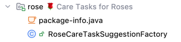

# Spring Modulith Example Application

This repository contains the source code for my article ["Deep Dive Spring Modulith"](https://nilshartmann.net/a/spring-modulith-deep-dive-heise-developer), published by heise developer (german).



# Examples

In this repository you'll find examples for:
- application modules
- named interfaces (`care.suggestion`)
- open application modules (`shared`)
- moments API (`InvoiceGenerator`)
- modularized flyway migration scripts (`resources/db/migration`)
- async event handling (`CareService`, `UsageTracker`)
- externalized events (published to Kafka, `InvoiceGenerator`, `InvoiceGeneratedEvent`)
- module tests

# Getting started

As this example has no frontend (only some HTTP endpoints), best is to run the test cases in the `test` folder.

Otherwise you can run the backend, by starting the `PlantifyApplication` class. Thanks to Spring Boot docker compose support, that will also automatically start the required postgres DB and Kafka (see `compose.yaml`).

## Swagger

You can use the Swagger UI to interact with the application's endpoints: http://localhost:8080/swagger-ui/index.html


## Creating Plants
You can add a new plant by running an HTTP call for example with curl:

```bash
curl -X POST --location "http://127.0.0.1:8080/api/plants" \
    -H "Content-Type: application/json" \
    -d '{
          "location": "Balkon",
          "name": "Cannabis (natürlich nur für medizinische Zwecke)",
          "ownerId": "85483586-044c-9778-73b1-6327133cf030",
          "plantType": "SUMMER_FLOWERS"
        }'
```

👉 See the logs for raised events and their processing

## Completing care tasks

1. Get the id of a care task by first getting all available care tasks that have been created when adding a new plant:
    ```bash
        curl --location "http://127.0.0.1:8080/api/care-tasks"
    ```
2. Complete one or more care tasks by using the `POST /api/care-tasks/{careTaskId}/complete` endpoint with a care point id from step 1:
    ```bash
    curl -X POST --location "http://127.0.0.1:8080/api/care-tasks/CARE-TASK-UUID/complete"
    ```

## Generating an invoice

When a month has passed an invoice is generated and sent to the `invoices` topic in Kafka.

You can make a "time shift" to simulate the passing of a month. Use the demo endpoint `POST /api/time-machine/{days}` to "fast forward" the specified amount of days:

Set the number of days (in the example `20`) high enough so that there is at least one month passing.

```bash
  curl -X POST --location "http://127.0.0.1:8080/api/time-machine/20"
```

👉 Have a look at the backend output: you should see that the app has generated an invoice and sent it to Kafka
👉 You can use the Kafka tooling of your choice to inspect the `invoices` topic. Personally I use the built-in Kafka tooling of IntelliJ


# Observation

Spring Modulith records tracing to Micrometer. The example application is configured to use Zipkin as Frontend. You can start Zipkin using docker:
`docker run -d -p 9411:9411 openzipkin/zipkin`
Now, when running the application, after registering a new plant (or any other event), you will see traces in Zipkin: http://localhost:9411/zipkin/


# Contact

If you have questions, comments or feedback, do not hesitate to contact me. You can find my [contact data here](https://nilshartmann.net/contact).
